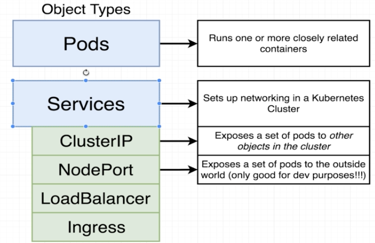

# Cluster IP service

Instead of using **NodePort** service (only good for dev purposes), we should use **ClusterIP** service.



With **ClusterIP** we cannot access from the outside world the **Pod** through an IP and port as we did with **NodePort**. On the other hand, anything else running inside the cluster can access whatever object the **ClusterIP** is pointing at. Non traffic from outside can reach **ClusterIP** service.

In the k8s App Infra diagram describe above, we can see that the **ClusterIP** services are access only through **Ingress** service.

#### Differences between NodePort and ClusterIP

There is not **nodePort** property because it is not addressable or accessible from the outside world.

#### Equalities between NodePort and ClusterIP

The **port** property is going to be how other pods or other objects inside of our cluster are going to access the **Pod** that we are kind of governing access to.

The **targetPort** is going to be the port on the target **Pod** that we are providing access to. The port that container provides its service.

## Combination of files

We could specify the **ClusterIP** and **Deployment** on the same file, as below:

```yaml
apiVersion: apps/v1
kind: Deployment
metadata:
  name: server-deployment
spec:
  replicas: 3
  selector:
    matchLabels:
      component: server
  template:
    metadata:
      labels:
        component: server
    spec:
      containers:
        - name: server
          image: ricardosouzamorais/multi-fib-server
          ports:
            - containerPort: 5000 
---
apiVersion: v1
kind: Service
metadata:
  name: server-cluster-ip-service
spec:
  type: ClusterIP
  selector:
    component: server
  ports:
    - port: 5000
      targetPort: 5000
```