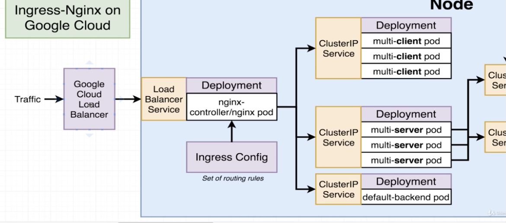
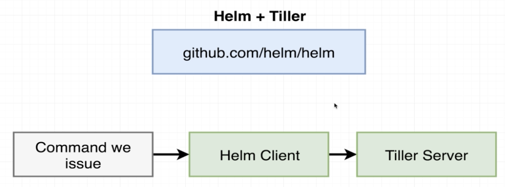
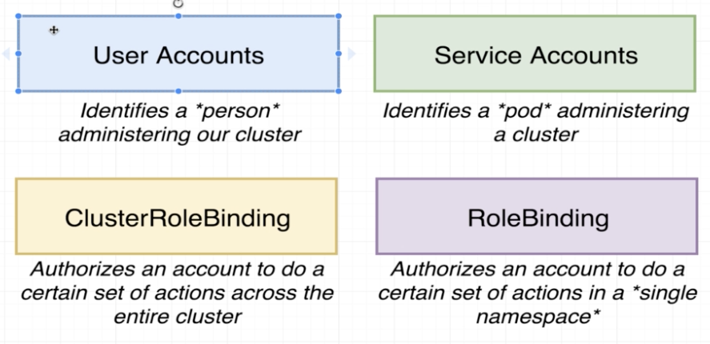

# K8S Production

## Project, Billing and k8s engine

Create a billing account and a project linking them together.

Also, create a **k8s** engine as shown in videos 238, 239 and 240.

## Travis CI

We need to use `docker` on Travis CI file, so remember to use `sudo`.<br/>
Docker will be used to run builds, tests and other stuff.


```yaml
sudo: required
services:
  - docker
```

### Commands run before the tests
*  Download and install Google Cloud SDK
*  Look at the default install directory and source the file
*  Install kubectl inside out Travis env
*  Authorize gcloud to execute stuff (Service Account is similar to AIM used in AWS)

*  Unencrypt service-account.json file
*  Download and install Google Cloud SDK
*  Look at the default install directory and source the file
*  Install kubectl inside out Travis env
*  Authorize gcloud to execute stuff (Service Account is similar to AIM used in AWS) 
*  Set project on GCP
*  Set the zone of the project
*  Tell to reach cluster and wotk with our cluster "mult-cluster"
*  Log in to the docker CLI. The echo command sends the value of env variable and then essentially emit that over stdin as input to the next command (after pipe)

```yaml
before_install:
  - openssl aes-256-cbc -K $bla -iv $bla2 -in service-account.json.enc -out service-account.json -d
  - curl https://sdk.cloud.google.com | bash > /dev/null;
  - source $HOME/google-cloud-sdk/path.bash.inc
  - gcloud components update kubectl
  - gcloud auth activate-service-account --key-file service-account.json
  - gcloud config set project multi-k8s-249701
  - gcloud config set compute/zone southamerica-east1-a
  - gcloud container clusters get-credentials multi-cluster
  - echo "$DOCKER_PASSWORD" | docker login -u "$DOCKER_ID" --password-stdi 
  - docker build -t ricardosouzamorais/client-tests -f ./client/Dockerfile.dev ./client
```

### Commands run for deploy

Call a separate script due to the fact that **Travis** does not have a built-in deploy process for **ks8**.

```yaml
deploy:
  provider: script 
  script: bash ./deploy.sh
  on:
    branch: master
```

On the deployment script build, tag and push the images using **latest** and also the git SHA.

Apply the **k8s** folder using kubectl that is already available to **Travis** since it was added before.

To make sure that the cluster runs the latest images, set the image generated with git SHA tag, for example:

```bash
kubectl set image deployments/client-deployment \
        client=ricardosouzamorais/multi-fib-client:$GIT_SHA
```

### Service Account

We need to create a service account on Google CP that allows us to manipulate the **k8s** engine created for our project.

This `service-account.json` file is very sensitive, so we need to encrypt it and that is going to be done using **Travis CI CLI**, which needs **Ruby**.


#### Encrypting action


Use `docker` to run this encrypt action based on **Ruby 2.3**. Do not use the alpine version because does not have all the dependencies need to install this gem.

```bash
docker run -it -v $(pwd):/app ruby:2.3 sh
gem install travis
travis login 
travis encrypt-file service-account.json -r ricardo-aspira/dk-fib-calculator-k8s
```

*  `travis login` will use your GitHub credentials

### Before sending all stuff to GitHub 

Before sending all stuff to GitHub and consequently be built by **Travis**, we need to create a secret that allows multi-server to connect to **PostgreSQL** and the **PostgreSQL** in fact to start with that password.

First of all, activate Google Cloud Shell through the console. After that, you need to run some of the commands that are in the **Travis** yaml file:

```bash
gcloud config set project multi-k8s-249701
gcloud config set compute/zone southamerica-east1-a
gcloud container clusters get-credentials multi-cluster
```

Now, create the secret:

```bash
kubectl create secret generic SECRET_NAME --from-literal KEY=VALUE
```

## Nginx on Google Cloud



We need to create a load balancer service instead of ingress service and map it to a Google Cloud load balancer and then also setup a deployment running the ingress controller and the actual nginx pod that will be the real routing.

Remember that we want [ingress-nginx](https://kubernetes.github.io/ingress-nginx/deploy/#using-helm) and this time we can install using **Helm** instead of running all commands one by one.

### Helm



**Helm** is a program that we can use to administer third party software inside our **k8s** cluster.

When we install **Helm**, we actually install two pieces of software. The first is the **Helm** also called **Helm Client** which is essencially a CLI tool used to issue commands. The second if the **Tiller** also called **Tiller Server** that runs inside our **ks8** cluster and is responsible for modifying our cluster in some fashion and install additional objects inside of it.

#### Installing

Visit: https://helm.sh/docs/using_helm/#installing-helm

Use the **from script** commands and after installing, do not run **helm init** before configuring the following.

##### Create a service account for Tiller

Google’s GKE hosted Kubernetes platform enables RBAC by default. You will need to create a service account for tiller, and use the –service-account flag when initializing the helm server.

https://helm.sh/docs/using_helm/#role-based-access-control



*  Create a new service account called tiller in the **kube-system** namespace
   `kubectl create serviceaccount --namespace kube-system tiller`
*  Create a new cluster role binding (applies to the entire cluster instead of a namespace only as role binding does) with the role `cluster-admin` (pre-set role) and assign it to service account `tiller` that has been created
    `kubectl create clusterrolebinding tiller-cluster-rule --clusterrole=cluster-admin --serviceaccount=kube-system:tiller`
*  Now, you can start helm but telling him which service account to be assigned: `helm init --service-account tiller --upgrade`; `upgrade`just make sure we are using the latest version of **Helm**
