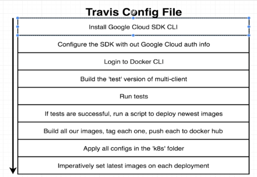
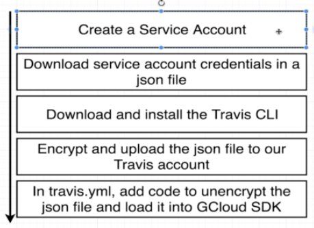
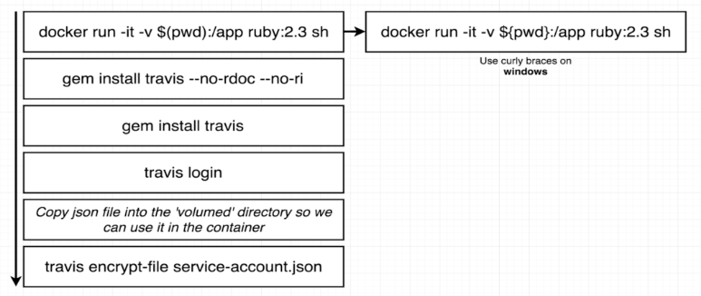

# K8S Production

## Project, Billing and k8s engine

Create a billing account and a project linking them together.

Also, create a **k8s** engine as shown in videos 238, 239 and 240.

## Travis CI

We need to use `docker` on Travis CI file, so remember to use `sudo`.<br/>
Docker will be used to run builds, tests and other stuff.



```yaml
sudo: required
services:
  - docker
```

### Commands run before the tests
*  Download and install Google Cloud SDK
*  Look at the default install directory and source the file
*  Install kubectl inside out Travis env
*  Authorize gcloud to execute stuff (Service Account is similar to AIM used in AWS)

*  Unencrypt service-account.json file
*  Download and install Google Cloud SDK
*  Look at the default install directory and source the file
*  Install kubectl inside out Travis env
*  Authorize gcloud to execute stuff (Service Account is similar to AIM used in AWS) 
*  Set project on GCP
*  Set the zone of the project
*  Tell to reach cluster and wotk with our cluster "mult-cluster"
*  Log in to the docker CLI. The echo command sends the value of env variable and then essentially emit that over stdin as input to the next command (after pipe)

```yaml
before_install:
  - openssl aes-256-cbc -K $bla -iv $bla2 -in service-account.json.enc -out service-account.json -d
  - curl https://sdk.cloud.google.com | bash > /dev/null;
  - source $HOME/google-cloud-sdk/path.bash.inc
  - gcloud components update kubectl
  - gcloud auth activate-service-account --key-file service-account.json
  - gcloud config set project multi-k8s-249701
  - gcloud config set compute/zone southamerica-east1-a
  - gcloud container clusters get-credentials multi-cluster
  - echo "$DOCKER_PASSWORD" | docker login -u "$DOCKER_ID" --password-stdi 
  - docker build -t ricardosouzamorais/client-tests -f ./client/Dockerfile.dev ./client
```

### Service Account

We need to create a service account on Google CP that allows us to manipulate the **k8s** engine created for our project.

This `service-account.json` file is very sensitive, so we need to encrypt it and that is going to be done using **Travis CI CLI**, which needs **Ruby**.



#### Encrypting action



Use `docker` to run this encrypt action based on **Ruby 2.3**. Do not use the alpine version because does not have all the dependencies need to install this gem.

```bash
docker run -it -v $(pwd):/app ruby:2.3 sh
gem install travis
travis login 
travis encrypt-file service-account.json -r ricardo-aspira/dk-fib-calculator-k8s
```

*  `travis login` will use your GitHub credentials
