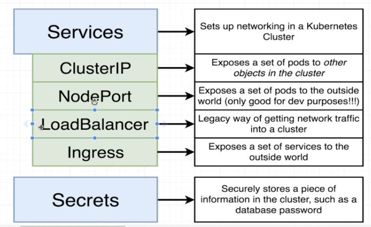
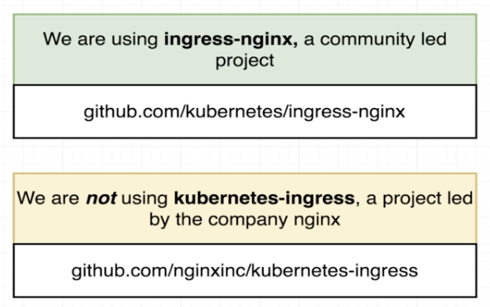
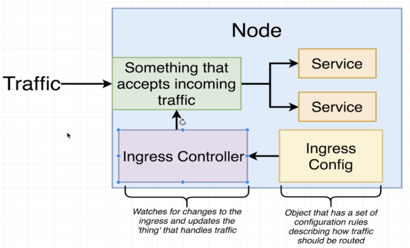
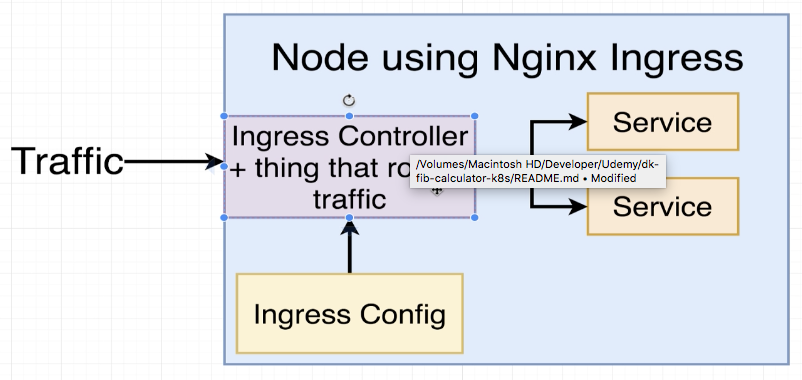
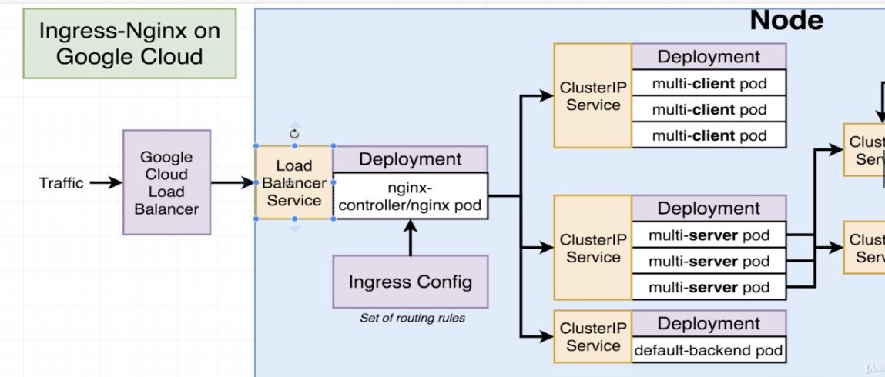

# Load Balancer and Ingress

LoadBalancer is a legacy way of getting some amount of traffic into your application.

## Load Balancer 

Actually does two separate things inside of your cluster.

A Load Balancer gives access to one set of pods only but in our case there are two sets of pods that we want to expose to outside world (**multi-server** and **multi-client**).

**k8s** is going to reach out your cloud provider and it is going to create a Load Balancer.
You need a Load Balancer outside of your cluster in order to access the load balancer inside of your cluster.

## Ingress

Exposes a set of services to the outside world. 
There are several different implementations of ingress. We are going to use [**ingress-nginx**](http://github.com/kubernetes/ingress-nginx) not **kubernetes-ingress** that is a project from nginx company.

Setup of [**ingress-nginx**](http://github.com/kubernetes/ingress-nginx) changes depending on your environment (local, GC, AWS, Azure etc). In this course, we are going to use local and GC.

### Behind the Scenes of Ingress

We are going to create **Ingress Config** file which is going to be a set of routing rules, feed that file into ***kubectl*** that will create this ingress controller. The ingress controller is going to make something that accepts incoming traffic.

In the [**ingress-nginx**](http://github.com/kubernetes/ingress-nginx), the Ingress Controller and the thing that accepts incoming traffic are the same thing.

### Behind the Scenes with Google Cloud

A Google Cloud Load Balancer is created and it sends traffic to a **LoadBalancer** service (the one we said that is not being used anymore) inside the cluster which is going to eventually get that traffic into the nginx ***Pod*** that gets created by our nginx controller. After that, it is up to the nginx ***Pod*** to eventually send that traffic off to the appropriate service inside our cluster.

Another deployment is setup inside your cluster, that is called **default-backend pod**, that is used for a series of health checks to essentially make sure that our cluster is working as expected. In the ideal world, you would replace this default-backend by your API.

[Ingress Nginx Deployment](https://kubernetes.github.io/ingress-nginx/deploy)

### The Ingress Config File

[ingress-service.yaml](k8s/ingress-service.yaml)

*  `metadata/annotations` - Higher level configurations around ingress object that is got created.
   *  `kubernetes.io/ingress.class: nginx` - tells the ***k8s*** that we want to create an ingress controller based on nginx project
   *  `nginx.ingress.kubernetes.io/rewrite-target: /` - how our copy of nginx behaves. After deciding sending that to **Server** instead of **Client**, it is going to do some rewrite on the request, for example, removing the `/api` part.
* `rules`- are saying that there are two possible paths that we can match traffic to.