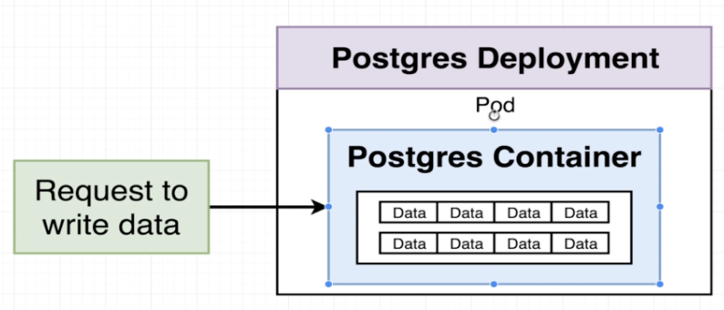
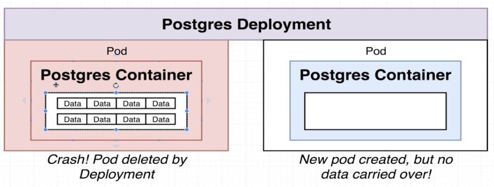
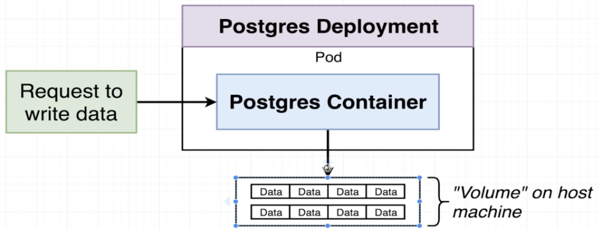
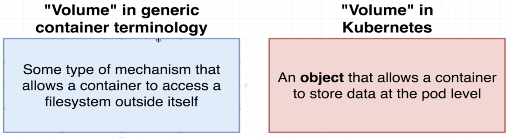
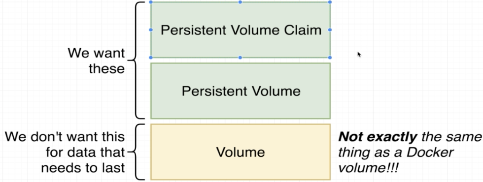
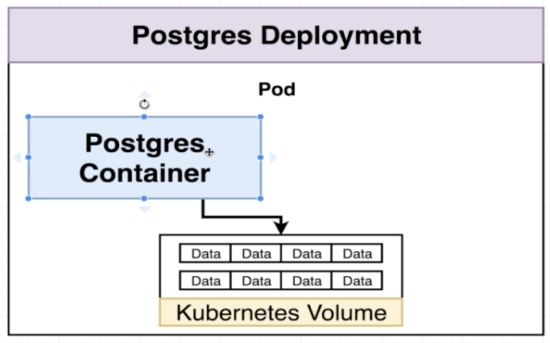
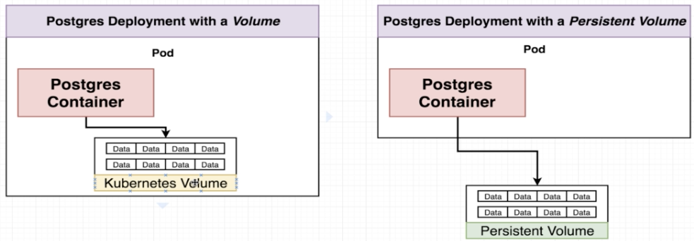

# Postgres PVC

***PVC*** stands for Persistent Volume Claim.

Without configuring a **PVC** we will have this kind of situation.



If we do not specify a persistent volume and **Pod** goes away, we will lose all data.



Instead of writing data inside the container, we need to write data into this persistent volume that exists outside on host machine.



## Replicas of Postgres on Deployment file

You will notice that inside our postgres-deployment file we specified the number of replicas as ***ONE (1)***.

In fact we can setup postgres to have some kind of replication or a clustering that is going to improve the availability and performance of our database. If we just increase the number of replicas to ***TWO (2)***, we would end up with a situation where two Pods that might be accessing the same volume but having two different databases accessing the same file system without them being aware of each other and have them very distinctly cooperate with eatch other, is a recipe for disaster.

That is not just isolated to postgres world, it is for many other databases you are going to find the same problem. So for whatever reason you want to scale up your copy of postgres and make it more available, you have to go through some additional steps.

# Volume - Container V.S. Kubernetes Terminology





## Volume on Kubernetes

We can have a Kubernetes Volume that could be accessed by any container inside that ***Pod***.



The downside is that the volume is tied to the ***Pod*** and so if ***Pod*** itself ever diest the volume dies and goes away as well.

Volume will survive container restarts inside of a ***Pod*** but not ***Pod*** crashes/recreation.

## Volume V.S. Persistent Volume



Persistent is some type of long term durable storage that is not tied to any specific ***Pod*** or any specific container. 

## Persistent Volume V.S. Persistent Volume Claim

PVC are just like the advertisements, not actually volumes. They cannot persist anything just show the options available in the cluster.

Inside our cluster we might have some number of persistent volumes that have been created ahead of time. They are actually instances of hard drives essentially that can be used right away for storage.

Any persistent volume that is created ahead of time inside of our cluster is called **Statically provisioned Persistent Volume**. On the other hand, we also had another option that could be created on the fly which is called **Dynamically provisioned Persistent Volume**.

# Claim Config Files

A config file that has the **kind** property as ***PersistentVolumeClaim*** is not an actual instance of storage, but it is something that we are going to attach to a ***Pod*** config. If we attach the `database-persistent-volume-claim.yaml`do a ***Pod***, ***k8s*** must find an instance of storage like a slice of your HD that meets this requirement.

## Access Modes


## Allocation of Persistent Volume by k8s

On your personal computer, ***k8s*** it gets a slice from your HD.<br/>
You can use the following commands in order to check the storage classes and their details:
*  `kubectl get storageclass`
*  `kubectl describe storageclass`

When we are talking about a Cloud Provider, we can have it from a lot of options like Google Cloud Persistent Disk, Azure File, Azure Disk, AWS Block Store.<br/>
You can see other options in [Storage Classes Options](https://kubernetes.io/docs/concepts/storage/storage-classes) link.

## Linking PVC to Pod

We do it with `volumes` inside Deployment config file but that is not enough, besides specifying, we need to link it to the container through `volumeMounts` configuration inside the same config file.

**ATTENTION:** The **volume name** and **volume mount name** should be identical.

The `mountPath` property of the `volumeMount` is where inside the container this storage should be available.

The `subPath` is not needed for a normal application but in our case, for Postgres, it is needed and it means that any data inside the container that is stored inside of this mount path, is going to be stored inside of a folder with this name in the actual persistent volume claim.

```yaml
apiVersion: apps/v1
kind: Deployment
metadata:
  name: postgres-deployment
spec:
  replicas: 1
  selector:
    matchLabels:
      component: postgres
  template:
    metadata:
      labels:
        component: postgres
    spec:
      volumes:
        - name: postgres-storage
          persistentVolumeClaim:
            claimName: database-persistent-volume-claim
      containers:
        - name: postgres
          image: postgres
          ports: 
            - containerPort: 5432
          volumeMounts:
            - name: postgres-storage
              mountPath: /var/lib/postgresql/data
              subPath: postgres
```

To get information about PV from your cluster, run `kubectl get pv` and for PVC, run `kubectl get pvc`.